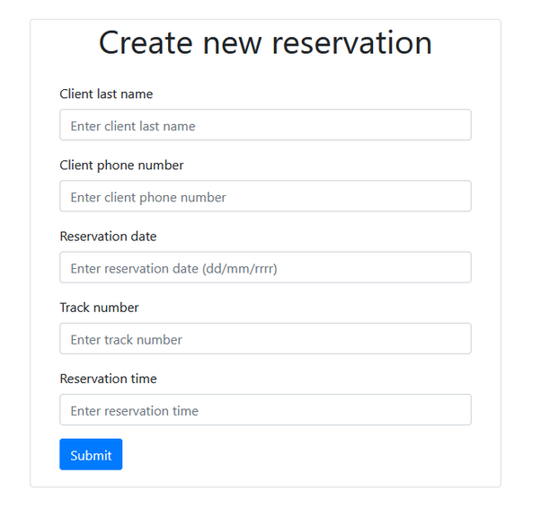
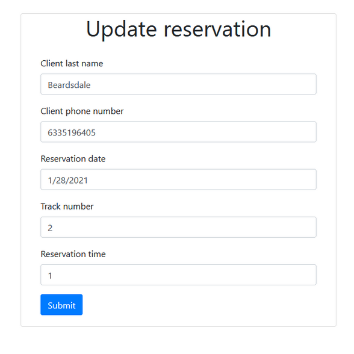
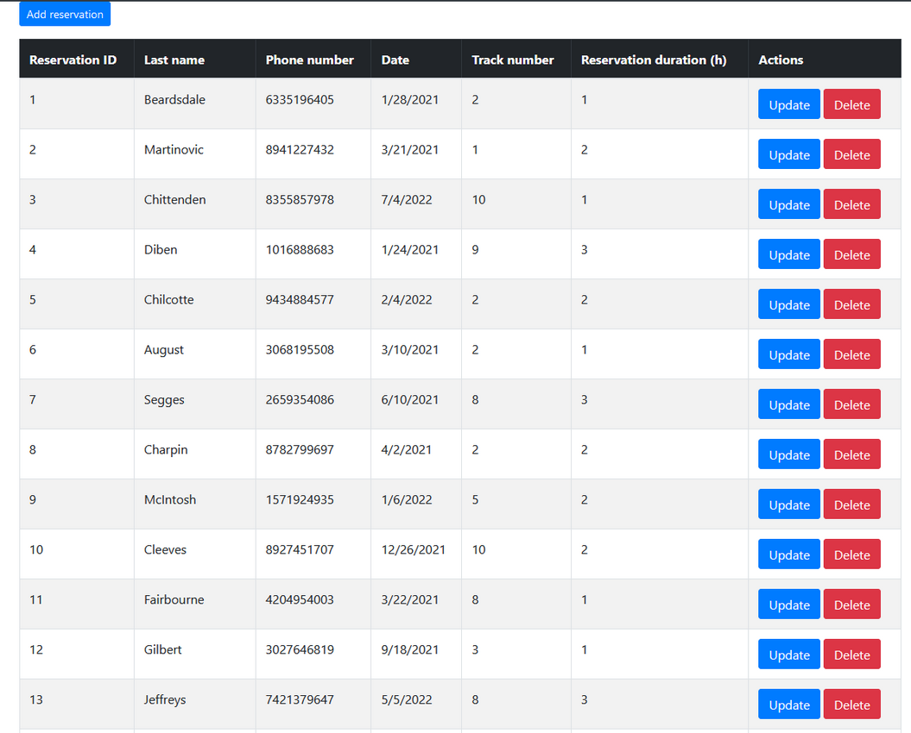
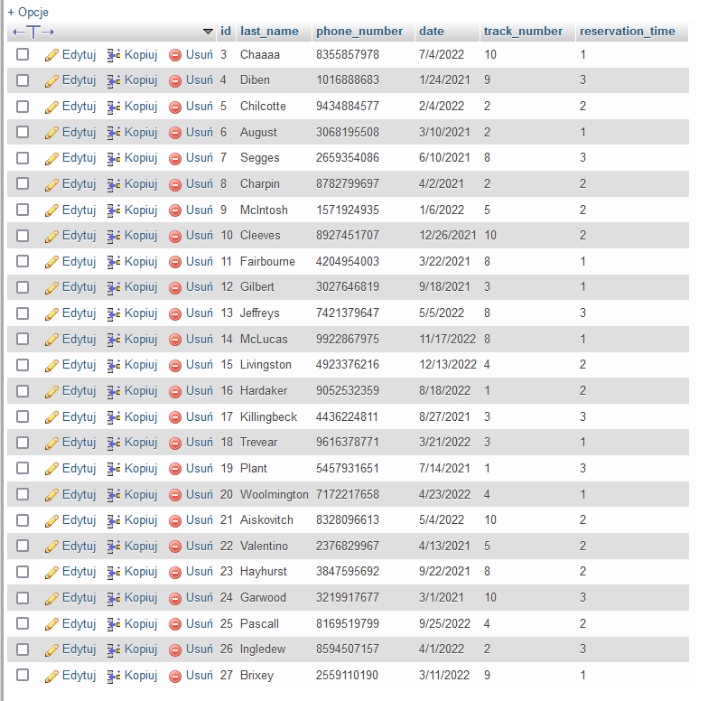

System zarządzania bazą danych na przykładzie rezerwacji dla kregielni

Możemy dodawać rezerwację:

Zaaktualizować rezerwację:

Oraz przeglądać rezerwację i je usuwać:

Wszystko jest na bieżąco aktualizowane w bazie danych:

